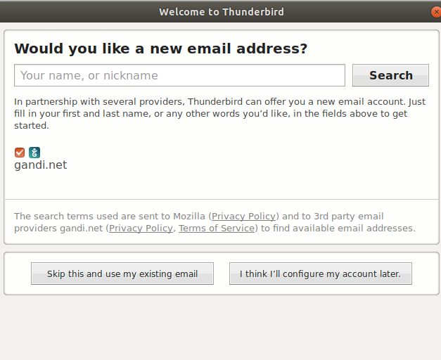
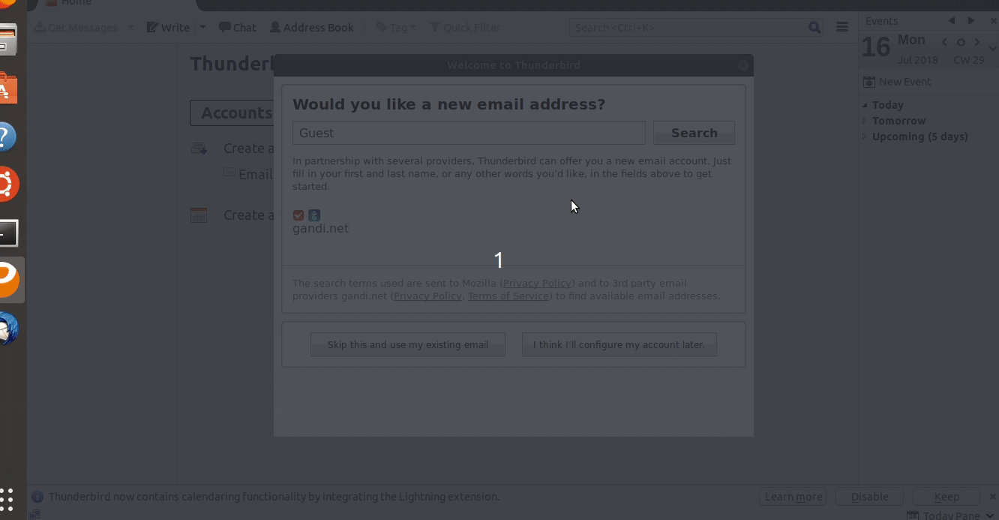
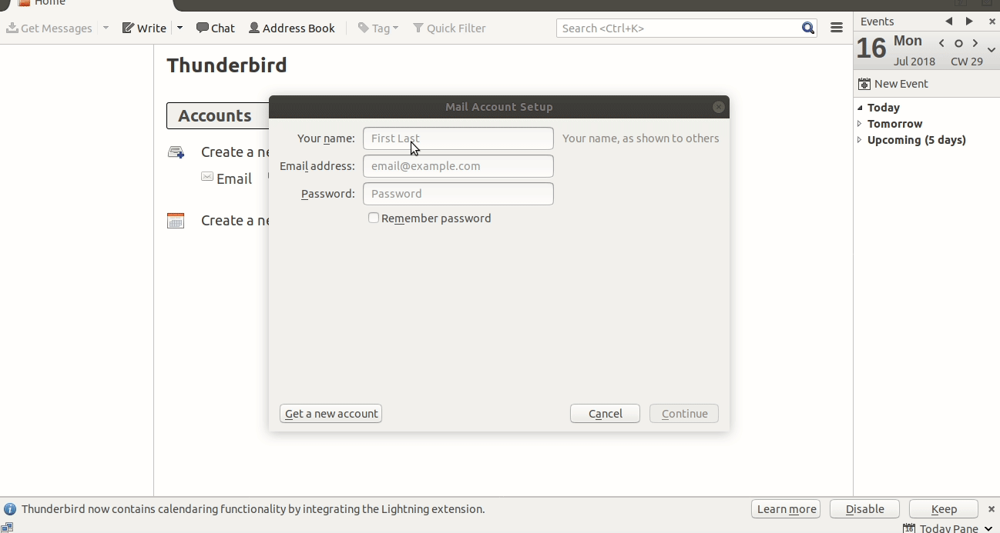
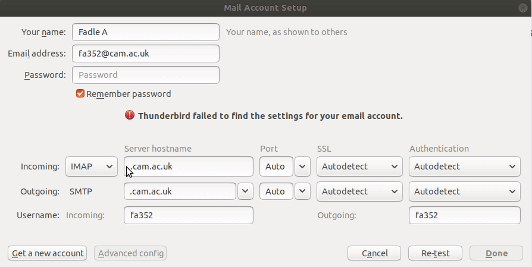
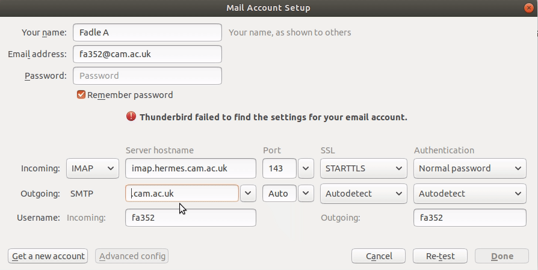
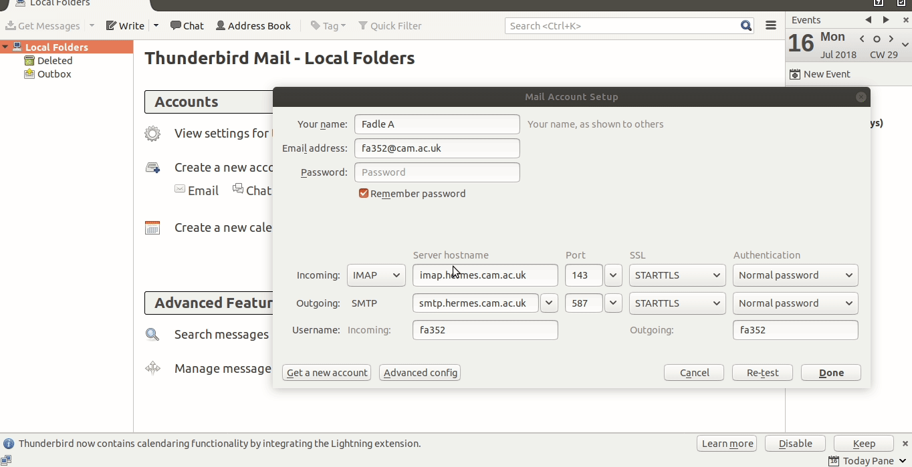
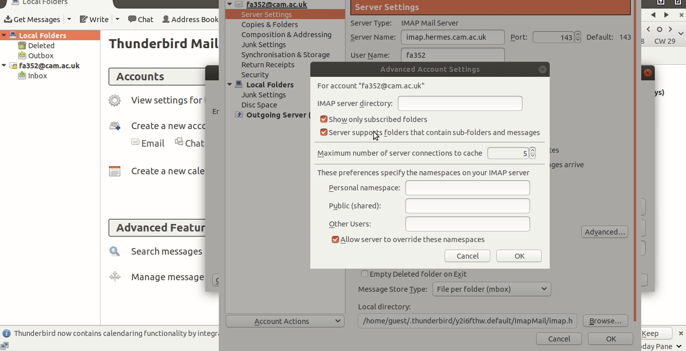
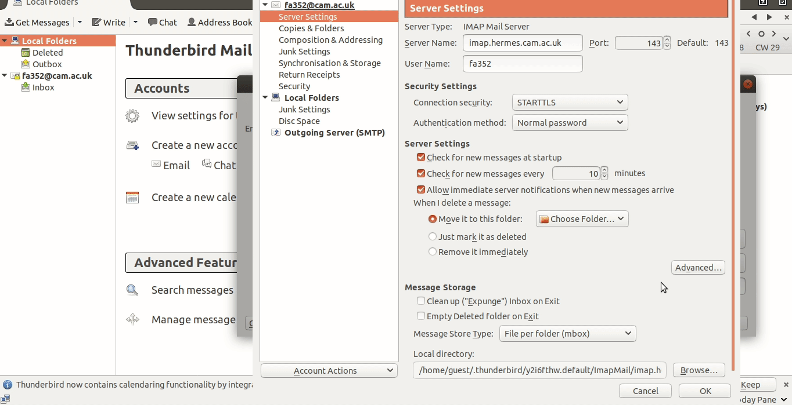
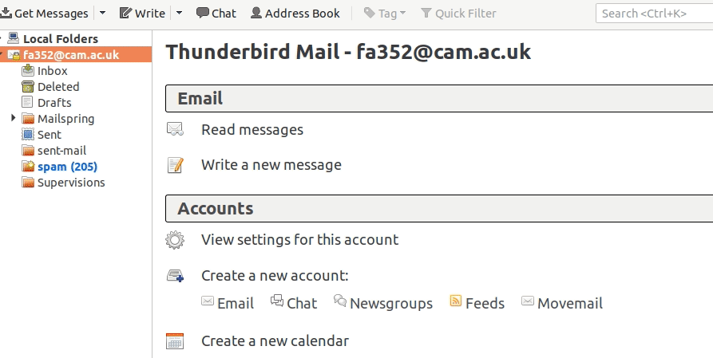
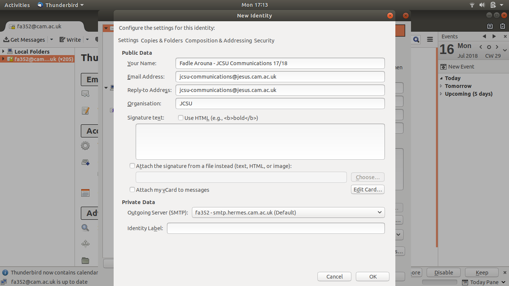

# Setting up your JCSU Email

## Step 1 : Installing Thunderbird

To install Thunderbird, simply click [here](https://www.thunderbird.net/en-GB/) or do a Google search for "Mozilla Thunderbird" and you should be prompted with a download button. Click it and run the downloaded file.

## Step 2: Setting it up

Upon opening Thunderbird, you should be greeted with a screen like this

Proceed by choosing "Skip this and use my existing email option"

On the next screen, do the following:
  * Complete Your name
  * For 'Email address' use CRSid@cam.ac.uk (e.g. xyz789@cam.ac.uk)
  * **Do not put in your password at this stage.**
  
  

Now, Thunderbird will attempt to auto-configure but **will not succeed** and you'll be required to enter both Incoming and Outgoing settings.

### Incoming

* Check that the pull-down menu is set to IMAP
* Set Server hostname to imap.hermes.cam.ac.uk
* For Port select 143
* For Connection security select STARTTLS
* For Authentication select Normal password

### Outgoing

* For Outgoing
* Set Server hostname to smtp.hermes.cam.ac.uk
* Set Port to 587
* Set Connection security to STARTTLS
* Set Authentication to Normal password

**At this stage, make sure your 'username' matches your CRSID**

## Advanced Config
* Now select *Advanced Config*, followed by *Advanced*

* **Untick** the 'Show only subscribed folders field
* Make sure the Allow server to override these namespaces is **ticked**
* Click 'OK' twice to close both dialog boxes

## Get Your Emails

In the top left corner you should be able to click 'Get Messages' to import all your Hermes emails. If a message is displayed describing a failure, simply use the 'Retry' button and it should succeed.

## Step 3: Adding your JCSU Email address

The way JCSU emails work is a bit confusing

* **Receiving**
 Your ‘JCSU-XXXX@jesus.cam.ac.uk’ email only really exists as a forwarding address configured through Zeus.
 
The Communications officer links this forwarding address to your personal Hermes account on Zeus. Emails sent to the address will then arrive in your regular Hermes mailbox.

Email lists work in exactly the same way. It’s just that whilst e.g. JCSU-Badminton@jesus.cam.ac.uk forwards to many people, JCSU-Communications@jesus.cam.ac.uk only links to one.

* **Sending**

This raises the question of how you reply from your official address. It’s basically a bit of a fraud. You set up what’s called an email alias in your email client, so it looks as if the email was sent from an account called “JCSU…”. There’s actually nothing to stop some randomer in Uruguay from passing themselves off as the JCSU president.

To set this up, begin by left clicking on your email address, which should be displayed on the left hand side of your screen. Then choose "View Settings for this account"

* Click 'Manage Identities' , then 'Add'
* Fill in the form such that it looks vaguely similar to the following (Obviously names and email addresses will vary)
* Click 'OK' once done and close the dialog boxes

  
At this point, you should now be able to send messages from your regular Hermes email, as well as this new JCSU one!
Simply click 'Write' in the top left and there should be a drop-down menu in the 'From' field allowing you to choose the appropriate email.

